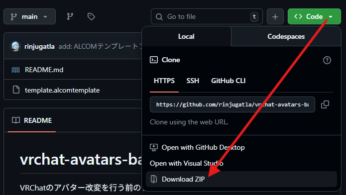
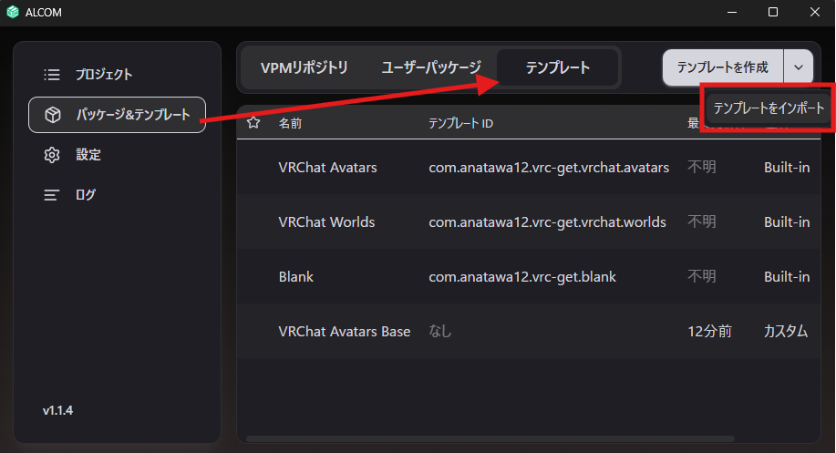
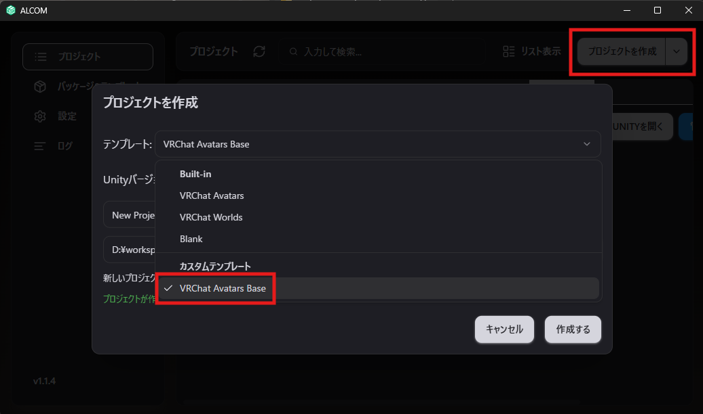

# ALCOM用アバターパッケージテンプレート

VRChatプロジェクト、パッケージ管理ツールALCOMのアバター用パッケージテンプレート

## 対象Unityバージョン

2022.3.22

## 基本パッケージ

| パッケージ名                      | バージョン | 備考                               |
| :-------------------------------- | ---------: | :--------------------------------- |
| VRChat SDK - Avatars              |      3.8.2 | 公式SDK                            |
| VRChat SDK - Base                 |      3.8.2 | 公式SDK                            |
| Gesture Manager                   |      3.9.4 | ギミックの確認                     |
| lilToon                           |      2.2.1 | シェーダー                         |
| lilAvatarUtils                    |      2.1.2 | テクスチャ、マテリアルの確認       |
| lilycalInventory                  |      1.4.5 | オブジェクトの出し入れ、明るさ調整 |
| lilEditorToolbox                  |     1.10.1 | エディタ拡張                       |
| lilNDMFMeshSimplifier             |      0.3.0 | 非破壊メッシュ削減                 |
| Gorone System (Supine)            |      4.3.1 | ごろ寝システム                     |
| Gorone System EX (Supine EX)      |      4.3.2 | ごろ寝システム                     |
| Non-Destructive Modular Framework |      1.9.0 | 非破壊アバター変換                 |
| Modular Avatar                    |     1.14.0 | アバター、衣装等の連携             |
| Floor Adjuster                    |      1.1.0 | アバター高さ位置調整               |
| AAO: Avatar Optimizer             |     1.8.13 | 非破壊アバター最適化               |
| anatawa12's gists pack            |     0.19.0 | アバター最適化結果の確認           |
| KiseteNe for MA                   |      1.2.0 | 非対応衣装の対応支援               |
| FaceEmo                           |      1.5.5 | 表情作成、設定                     |
| AvatarPoseLibrary                 |      1.1.8 | ポーズ管理                         |
| TexTransTool                      |      1.0.0 | 髪などのグラデーション管理         |
| TexTransCore                      |      0.2.0 | TexTransToolのライブラリ           |
| VRCQuestTools                     |     2.11.3 | アバターQuest対応支援              |

## 使い方

1. [ALCOM](https://vrc-get.anatawa12.com/ja/alcom/)をインストールします
2. 本リポジトリをダウンロード、解凍します

3. ALCOMのテンプレートをインポートから、ダウンロードした`template.alcomtemplate`ファイルをインポートします

4. ALCOMのプロジェクト作成時に`VRChat Avatars Base`テンプレートを選択します

